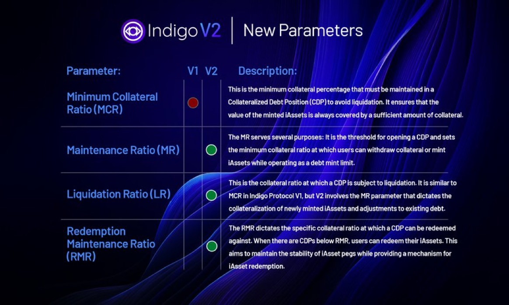

# Indigo Protocol Data Sources:
As specific documents are referenced in the research of the Indigo protocol they will be hosted here.

- [Indigo Official Website](https://indigoprotocol.io/)
- [Indigo Documents](https://docs.indigoprotocol.io/)
- [Indigo Whitepaper](./indigo-paper%20(1).pdf)
- [Indigo GitHub](https://github.com/IndigoProtocol)
- [Indigo Tokenomics](https://github.com/IndigoProtocol/tokenomics)
- [Indigo Governance Forum](https://forum.indigoprotocol.io/)
- [Indigo Official X Account](https://twitter.com/Indigo_protocol)
- [Indigo Discord Server](https://discord.gg/gVqDRNg7VH)

## Indigo v2 Specific Content/Updates:

- [Indigo v2 Tweet](https://x.com/Indigo_protocol/status/1770938594015781164)
- [Indigo Protocol v2: Dual Peg Mechanism](https://indigoprotocol1.medium.com/indigo-protocol-v2-dual-peg-mechanisms-7965ff8a38e2)
- [Indigo Protocol v2 Fee Restructure](https://www.bulbapp.io/p/af9b4931-1d5f-4d1d-ba56-4b0ff09d00a9/indigo-protocol-v2-fee-restructure)
- [Indigo v2 Proposal](https://x.com/Indigo_protocol/status/1765435352745914427)

## Indigo Deep Dive Research Topics
- Describe Emissions and Distrubtion of the token to date (along w/ any changes that may have happened since TGE)
- Detail founding entities holdings and vesting schedules (if publicly avaiable)
- Governance and DAO structure
- Highlighting key differences between v1 and v2
- Analysis and overview of the newly implement mechanisms in v2 around peg mechanisms
- Overview of token price along with protocol changes that have been implemented by the DAO since launch
- Feedback and Recommendations